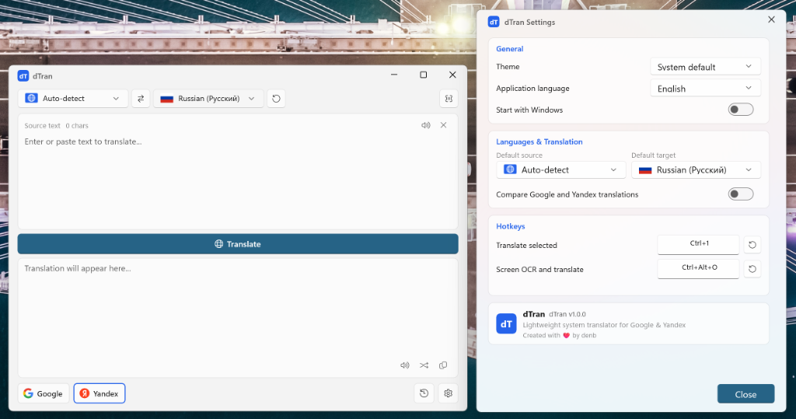

# dTran

> Быстрый и лёгкий всплывающий переводчик для Windows на базе Google Translate и Яндекс Переводчика.

[English](README.md) | [Русский](README.ru.md)

[](LICENSE)
[](https://github.com/denbdenb/dTran)
[](https://github.com/denbdenb/dTran/releases)



**dTran** — это нативный переводчик для рабочего стола Windows, работающий в системном трее. Выделите текст в любом приложении, нажмите глобальную комбинацию клавиш — мгновенно откроется всплывающее окно с переводом, а при необходимости исходный текст можно автоматически заменить переводом на месте.

---

## Основные возможности

* **Два движка перевода (Google и Яндекс):** Мгновенный перевод через веб-сервисы с автоматическим определением языка оригинала.
* **Всплывающий интерфейс (Popup-First):** Приложение незаметно находится в системном трее и мгновенно открывается по горячей клавише или клику по иконке.
* **Перевод выделенного (`Ctrl+Alt+T`):** Захват выделенного текста в любом активном окне (браузеры, текстовые редакторы, документы, мессенджеры) через UI Automation и буфер обмена.
* **Замена выделенного текста:** Переводит и сразу вставляет результат вместо исходного текста в активной программе, восстанавливая исходное содержимое буфера обмена.
* **Распознавание с экрана / OCR (`Ctrl+Alt+O`):** Быстрый инструмент выделения области экрана для распознавания текста через нативную библиотеку `Windows.Media.Ocr` с возможностью перевода или копирования.
* **Озвучивание текста (TTS):** Чёткое воспроизведение речи с автоопределением языка и последовательным потоковым воспроизведением длинных фраз.
* **Поддержка длинных текстов:** Интеллектуальное разбиение текста по абзацам и предложениям (`TextChunker`) переводит большие статьи без обрезки и потери структуры.
* **Сравнение переводов:** Возможность сопоставить результаты Google и Яндекс в одном окне в один клик.
* **История переводов:** Быстрая локальная история с поиском, мгновенным копированием и повторной вставкой текста.
* **Двуязычный интерфейс:** Полная локализация на **русский** и **английский** языки с мгновенным переключением на лету.
* **Автозапуск вместе с Windows:** Интеграция с нативным диспетчером автозагрузки Windows (`Windows.ApplicationModel.StartupTask`) с синхронизацией состояния в Диспетчере задач.
* **Современный стиль Windows 11:** Интерфейс на базе WinUI 3 и Fluent Design с поддержкой светлой и тёмной темы и бесшовным меню в трее.
* **Минимальное потребление памяти:** В фоновом режиме в системном трее потребляет всего **~9–15 МБ** оперативной памяти.

---

## Установка

### Рекомендуемый способ (Установщик Setup.exe)
1. Скачайте **[`dTran-1.0.0-x64-Setup.exe`](https://github.com/denbdenb/dTran/releases/latest)** из раздела последних релизов на GitHub.
2. Запустите установщик (устанавливает в стандартную папку `C:\Program Files\dTran` без необходимости включать Режим разработчика).
3. Все необходимые системные компоненты (Windows App SDK Runtime и VCLibs) уже встроены в дистрибутив.
4. Запустите dTran из меню «Пуск», ярлыка на рабочем столе или из трея.
5. Выделите любой текст в любой программе и нажмите `Ctrl+Alt+T` для перевода!

### Портативная версия (Portable Zip)
1. Скачайте архив **[`dTran-1.0.0-x64-Portable.zip`](https://github.com/denbdenb/dTran/releases/latest)**.
2. Распакуйте архив в любую удобную папку и запустите `dTranslate.exe`. Установка не требуется.

### Удаление
* Чтобы удалить приложение, откройте **Параметры Windows** → **Приложения** → **Установленные приложения** → найдите **dTran** → нажмите **Удалить**, либо воспользуйтесь ярлыком деинсталляции в меню «Пуск». Пользовательские настройки и история в `%LOCALAPPDATA%\dTranslate` при этом сохраняются.

---

## Поддерживаемые платформы

* **Windows 11 x64** (все редакции, версия 21H2 и новее)
* **Windows 10 x64** (сборка 19041 и новее)
* *Архитектура:* x64

---

## Горячие клавиши по умолчанию

| Комбинация | Действие |
|---|---|
| **`Ctrl + Alt + T`** | Перевести выделенный текст / Открыть окно dTran |
| **`Ctrl + Alt + O`** | Распознать текст с экрана (OCR) и перевести |
| **`Esc`** | Скрыть всплывающее окно в трей / Отменить выделение OCR |

> *Примечание: Комбинации клавиш можно изменить или сбросить в окне «Настройки».*

---

## Архитектура проекта

dTran написан на чистом **C++20** с использованием **C++/WinRT** и **WinUI 3**. В проекте не используются Electron, Node.js, среда .NET или WebView2.

```text
Системный трей Windows
    ↓
Всплывающее окно переводчика
    ├── Движок Google Translate
    ├── Движок Яндекс Переводчик
    ├── Распознавание Windows Media OCR
    ├── Озвучивание речи (TTS)
    ├── Локальная история переводов
    └── Окно настроек
```

* Сторонние облачные AI-сервисы и словари были исключены, чтобы обеспечить максимальную скорость отклика, полную приватность и минимальное потребление ресурсов.

---

## Конфиденциальность

* **Прямое соединение с провайдерами:** Запросы на перевод отправляются напрямую с вашего компьютера в Google и Яндекс по безопасному протоколу HTTPS.
* **Отсутствие промежуточных серверов:** У dTran нет внешних серверов, баз данных или систем сбора статистики.
* **Никакой телеметрии и трекеров:** Приложение не собирает данные пользователя и не отправляет отчёты об ошибках.
* **Локальное хранение данных:** Настройки и история переводов хранятся исключительно на вашем компьютере в `%LOCALAPPDATA%\dTranslate`.

---

## Сборка из исходного кода

### Требования
* Windows 10/11 x64
* [Visual Studio 2022](https://visualstudio.microsoft.com/) (Community или Build Tools):
  * Разработка классических приложений на C++
  * Набор инструментов MSVC v143 (C++20)
  * Windows 10/11 SDK (10.0.22621.0 или новее)
* [Inno Setup 6](https://www.innosetup.com/) (для сборки установочного пакета)

### Шаги сборки

```powershell
# 1. Клонировать репозиторий
git clone https://github.com/denbdenb/dTran.git
cd dTran

# 2. Собрать релизный бинарный файл x64
powershell -ExecutionPolicy Bypass -File .\build.ps1 -Configuration Release

# 3. Запустить автоматические тесты (133/133 тестов)
powershell -ExecutionPolicy Bypass -File .\scripts\build_test_runner.ps1

# 4. Собрать пакеты дистрибутива (Setup.exe + Portable.zip)
powershell -ExecutionPolicy Bypass -File .\scripts\build_installer.ps1
```

Все собранные дистрибутивы будут помещены в каталог `dist/`.

---

## Лицензия

Проект распространяется под свободной лицензией [MIT License](LICENSE).  
Лицензии и уведомления сторонних компонентов описаны в файле [THIRD-PARTY-NOTICES.md](THIRD-PARTY-NOTICES.md).
